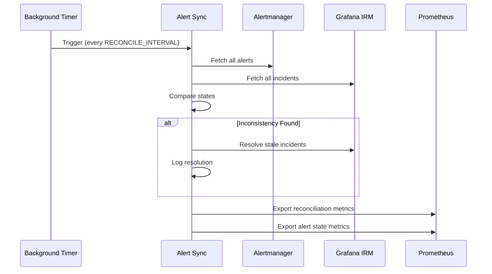
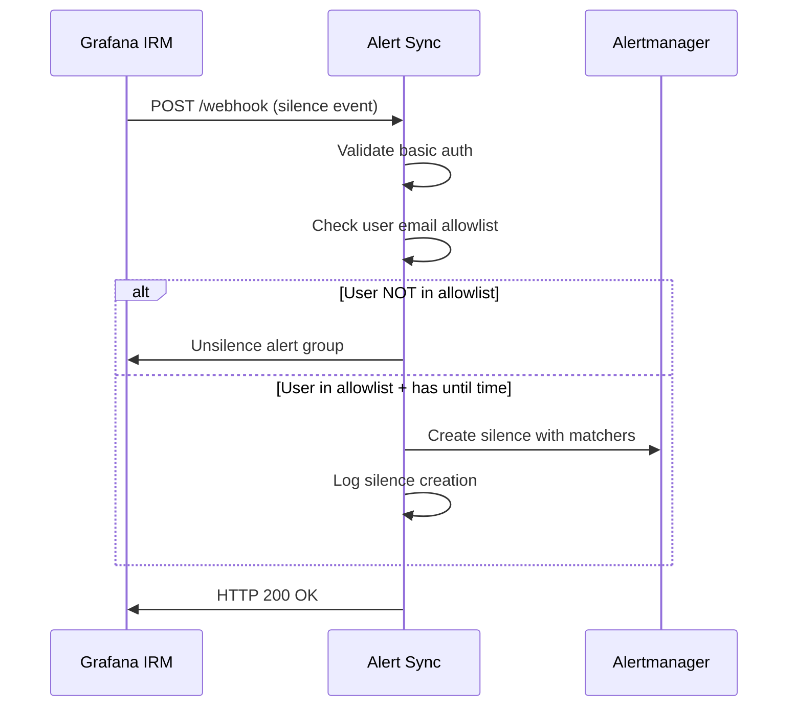

# Alertmanager Alert Sync

Synchronizes alerts between Prometheus Alertmanager and Grafana IRM, automatically resolving inconsistencies and exporting alert metrics.

## How It Works

This service syncronizes Prometheus AlertManager with Grafana IRM in these ways:
1. If an alert is Silenced in AlertManager but firing in Grafana IRM, it will be resolve in Grafana IRM.
2. If an alert is Silenced in Grafana IRM but firin in Grafana IRM, it will create a silence in AlertManager for that alert
  2.1 This will retrigger event 1, so the alert will be resolved in Grafana IRM
3. When the alert is Acked in Grafana IRM, the metric for that alert will be labeled with the person who acked.
4. When the alert is Silen in AlertManager, the metric for that alert will be labeled with the person who silenced it.

## Reconciliation Flow



## Webhook Flow



## Configuration

| Variable | Description | Example |
|----------|-------------|---------|
| `GRAFANA_IRM_URL` | Grafana IRM base URL | `https://your-grafana.com` |
| `GRAFANA_IRM_TOKEN` | Grafana IRM API token | `glsa_xxx` |
| `RECONCILE_INTERVAL` | Auto reconciliation (seconds) | `300` (5 min) |
| `ALERTMANAGER_HOST` | Alertmanager endpoint | `localhost:9093` |
| `ALERTMANAGER_ALERTS_LABELS` | Alert labels to export | `severity,cluster,namespace` |
| `ALERTMANAGER_ALERTS_ANNOTATIONS` | Alert annotations to export | `summary,description` |
| `WEBHOOK_USERNAME` | Webhook basic auth user | `webhook-user` |
| `WEBHOOK_PASSWORD` | Webhook basic auth pass | `secure-pass` |
| `WEBHOOK_EMAIL_ALLOWLIST` | Allowed silence users | `admin@co.com,ops@co.com` |

**Note:** Alert metrics automatically include Grafana IRM timestamps (`acknowledged_at`, `created_at`, `resolved_at`) formatted as RFC3339 strings (e.g., `2024-11-07T15:30:45Z`). Empty values indicate the event hasn't occurred.

## Quick Start

```bash
# Local Development
export GRAFANA_IRM_URL="https://your-grafana.com"
export GRAFANA_IRM_TOKEN="glsa_xxx"
export RECONCILE_INTERVAL="300"
export ALERTMANAGER_ALERTS_LABELS="severity,cluster,namespace"
go run cmd/alertmanager-alert-sync/main.go

# Docker
docker build -t alertmanager-alert-sync .
docker run -p 8080:8080 \
  -e GRAFANA_IRM_URL="https://your-grafana.com" \
  -e GRAFANA_IRM_TOKEN="glsa_xxx" \
  -e RECONCILE_INTERVAL="300" \
  -e ALERTMANAGER_ALERTS_LABELS="severity,cluster,namespace" \
  alertmanager-alert-sync

# Kubernetes
kubectl apply -f kubernetes/bundle.yaml
```

## Endpoints

| Endpoint | Purpose | Response |
|----------|---------|----------|
| `/metrics` | Prometheus metrics | Reconciliation & alert metrics |
| `/healthz` | Health check | 200 if reconciler ready |
| `/webhook` | Grafana IRM webhooks | Handles silence events |

## Metrics

Key metrics exposed at `/metrics`:

- `alertmanager_sync_reconciliation_total` - Reconciliation attempts
- `alertmanager_sync_reconciliation_failures_total` - Failed reconciliations  
- `alertmanager_sync_inconsistencies_found` - Current inconsistencies
- `alertmanager_sync_alert_state` - Alert states with default labels: `alertname`, `fingerprint`, `suppressed`, `acknowledged_by`, `resolved_by`, `silenced_by`, `inhibited_by`, `alert_group_id`, `acknowledged_at`, `created_at`, `resolved_at`, plus configured custom labels

**Useful Queries:**
```promql
# Success rate
rate(alertmanager_sync_reconciliation_total[5m]) - rate(alertmanager_sync_reconciliation_failures_total[5m])

# Active alerts by severity  
sum(alertmanager_sync_alert_state) by (severity)

# Suppressed alerts
sum(alertmanager_sync_alert_state{suppressed="true"})

# Acknowledged alerts with timestamps
alertmanager_sync_alert_state{acknowledged_by!=""}

# Recently created alerts (created in last hour, requires external time comparison)
alertmanager_sync_alert_state{created_at!=""}
```

## Webhook Setup

Enable Grafana IRM silence management:

```bash
export WEBHOOK_USERNAME="webhook-user"  
export WEBHOOK_PASSWORD="secure-password"
export WEBHOOK_EMAIL_ALLOWLIST="admin@company.com,ops@company.com"
```

**Grafana IRM Configuration:**
1. Settings → Webhooks → New webhook
2. URL: `https://your-service:8080/webhook`
3. Auth: Basic Auth with above credentials
4. Events: Enable "Silence" events

**Behavior:**
- Users NOT in allowlist → Alert automatically unsilenced
- Users in allowlist → Silence created in Alertmanager with proper matchers

## Architecture

```
cmd/alertmanager-alert-sync/     # Application entry point
internal/
  ├── alertmanager/              # Alertmanager client  
  ├── grafana/                   # Grafana IRM client
  ├── metrics/                   # Prometheus metrics
  ├── server/                    # HTTP handlers
  └── sync/                      # Reconciliation logic
```

## Development

```bash
# Run locally
go run cmd/alertmanager-alert-sync/main.go

# Run tests  
go test ./...

# Build
go build -o alertmanager-alert-sync cmd/alertmanager-alert-sync/main.go
```
